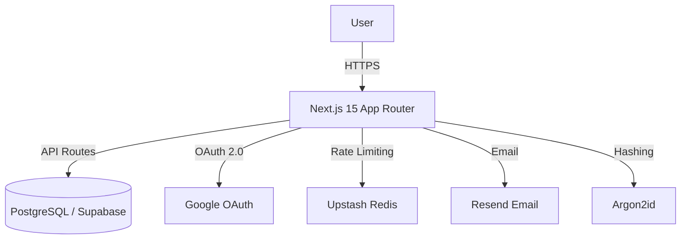

<p align="center">
  
</p>

<p align="center">
  <a href="https://hash-lock.pavicodes.in">
    
  </a>
  
  
</p>

---

## Description

Hash Lock is a robust, security-focused authentication system. It demonstrates how to implement production-grade security patterns — including **OAuth 2.0**, **Role-Based Access Control (RBAC)**, **stateful session management**, and **brute-force protection** — without relying on any third-party auth libraries.

🔗 **Live:** [https://hash-lock.pavicodes.in](https://hash-lock.pavicodes.in)

## Features

- **Custom Credentials Auth:** Secure email/password registration and login flows with Argon2id hashing.
- **OAuth 2.0 Integration:** "Sign in with Google" using the Authorization Code Flow with automatic account linking.
- **Role-Based Access Control (RBAC):** Server-side checks for User, Moderator, and Admin permissions.
- **Stateful Session Management:** Database-backed sessions using secure, HTTP-only, SameSite cookies.
- **Password Recovery:** Secure reset flow using time-limited, single-use cryptographic tokens.
- **Brute Force Protection:** IP-based sliding window rate limiting on sensitive endpoints via Upstash Redis.
- **Input Validation:** Strict Zod schema validation for all API inputs.
- **Email Notifications:** Password reset emails via Resend.
- **Secure Headers:** HSTS, X-Frame-Options, X-Content-Type-Options, and more on every response.

## System Architecture



## Database Schema

<p align="center">
  
</p>

## Screenshots

|              Admin Page              |             User Page              |              Login Page              |
| :----------------------------------: | :--------------------------------: | :----------------------------------: |
|  |  |  |

|              Signup Page               |
| :------------------------------------: |
|  |

## Installation

### 1. Clone the repository

```bash
git clone https://github.com/PraveenUppar/hashlock.git
cd hashlock
```

### 2. Install dependencies

```bash
npm install
```

### 3. Environment Setup

Create a `.env` file in the project root:

```env
# Database (Supabase Postgres)
DATABASE_URL="postgres://..."
DIRECT_URL="postgres://..."

# Google OAuth
GOOGLE_CLIENT_ID="your_google_client_id"
GOOGLE_CLIENT_SECRET="your_google_client_secret"

# App Configuration
NEXT_PUBLIC_APP_URL="http://localhost:3000"

# Rate Limiting (Upstash)
UPSTASH_REDIS_REST_URL="https://..."
UPSTASH_REDIS_REST_TOKEN="your_upstash_token"

# Email (Resend)
RESEND_API_KEY="re_..."
```

### 4. Database Setup

```bash
npx prisma generate
npx prisma migrate dev --name init
```

### 5. Run the development server

```bash
npm run dev
```

---

## System Workflows

### 1. User Registration Workflow

This flow ensures data integrity and cryptographic security before a user record is ever created.

1.  **Input:** Client submits email and password via the Sign-Up form.
2.  **Validation:** Zod schema validates email format and enforces password complexity (min 8 characters).
3.  **Uniqueness Check:** The system queries the database to ensure the email is not already registered.
4.  **Hashing:** The password is passed through the **Argon2id** algorithm, which generates a unique salt and hashes the credential.
5.  **Storage:** The new user record is created in the PostgreSQL database with the hashed password.
6.  **Response:** The user is redirected to the Login page.

### 2. User Login Workflow

The login process handles credential verification and session creation with brute-force protection.

1.  **Rate Limiting:** The request IP is checked against Upstash Redis. If >5 attempts in 60s, the request is blocked with a 429 response.
2.  **Lookup:** The system retrieves the user record by email.
3.  **Verification:** The provided password is verified against the stored hash using Argon2id.
4.  **Session Creation:** A UUID-based session is created in the database with a 7-day expiry, and a secure HTTP-only cookie is set.
5.  **Enumeration Protection:** The same generic error message is returned for both invalid email and wrong password.

### 3. OAuth 2.0 Workflow (Google)

This project implements the standard Authorization Code Flow to securely authenticate users without handling raw Google passwords.

1.  **Request:** User clicks "Sign in with Google". The app redirects to `accounts.google.com` with the Client ID and Scope (Email/Profile).
2.  **Consent:** User logs in to Google and grants permission.
3.  **Callback:** Google redirects back to `/api/auth/google/callback` with a temporary authorization `code`.
4.  **Exchange:** The server sends this `code` + `client_secret` directly to Google (backend-to-backend) to obtain an `access_token`.
5.  **Profile Retrieval:** The server uses the access token to fetch the user's email and profile.
6.  **Account Linking:** If the email exists, the Google account is linked to the existing user. Otherwise, a new user is created (with `isVerified: true`).
7.  **Session Creation:** A secure session cookie is issued, and the user is redirected to the dashboard.

### 4. Forgot Password Workflow

A token-based flow designed to prevent "Email Enumeration" attacks.

1.  **Request:** User submits their email address.
2.  **Enumeration Protection:** The API always returns "If that email exists, we sent a link" (Status 200), regardless of whether the user was found.
3.  **Token Generation:** If the user exists, a cryptographic random 32-byte hex token is generated and stored in the `PasswordResetToken` table with a 1-hour expiration.
4.  **Email Dispatch:** A link containing the token (`/reset-password?token=xyz`) is emailed via Resend.
5.  **Verification:** When the user clicks the link, the server verifies the token exists and is not expired.
6.  **Reset:** User provides a new password. The server hashes it with Argon2id, updates the user record, and deletes the consumed token.

---

## Security Implementation

### Stateful vs. Stateless Session Management

This project deliberately chooses **Stateful (Database) Sessions** over Stateless (JWT) tokens. While JWTs are popular, stateful sessions offer superior security control.

| Feature                  | Stateful (Used in Hash Lock)                                                                                     | Stateless (JWT)                                                                                               |
| :----------------------- | :--------------------------------------------------------------------------------------------------------------- | :------------------------------------------------------------------------------------------------------------ |
| **Information Security** | **High.** The session ID is just a random UUID. It contains no user data.                                        | **Low.** The token contains user data (payload). Anyone can decode and read the information.                  |
| **Revocation**           | **Instant.** An admin can delete a session row in the DB to ban a user immediately.                              | **Impossible.** You cannot invalidate a JWT before it expires without building complex blacklists.            |
| **Data Mutability**      | **Flexible.** You can update user roles or permissions in the DB, and it reflects instantly on the next request. | **Rigid.** You cannot change data inside an issued token. You must wait for it to expire and issue a new one. |
| **Compromise Risk**      | **Isolated.** Compromise is limited to the auth system database.                                                 | **System-wide.** If one service leaks the signing key, the entire system is compromised.                      |
| **Network Overhead**     | **Low.** The cookie is a tiny UUID string.                                                                       | **High.** Tokens grow large as you add user roles and data, increasing bandwidth on every request.            |


### Rate Limiting (Upstash Redis)

To prevent brute-force attacks on the login endpoint:

- **Algorithm:** Sliding Window
- **Limit:** 5 requests per 60 seconds per IP address
- **Storage:** Managed via Upstash Redis for low-latency, serverless rate checks

### Secure Headers

Security headers are injected into every response via `next.config.ts` to prevent common attacks:

| Header                      | Value                                          | Purpose                     |
| :-------------------------- | :--------------------------------------------- | :-------------------------- |
| `X-Content-Type-Options`    | `nosniff`                                      | Prevents MIME-type sniffing |
| `X-Frame-Options`           | `DENY`                                         | Clickjacking protection     |
| `X-XSS-Protection`          | `1; mode=block`                                | Legacy XSS filter           |
| `Strict-Transport-Security` | `max-age=63072000; includeSubDomains; preload` | Forces HTTPS for ~2 years   |
| `Referrer-Policy`           | `strict-origin-when-cross-origin`              | Limits referrer leakage     |

---

## Contributing

Contributions are welcome! To get started:

1. Fork the repository.
2. Create a new branch (`git checkout -b feature/your-feature`).
3. Commit your changes (`git commit -m 'Add your feature'`).
4. Push to the branch (`git push origin feature/your-feature`).
5. Open a Pull Request.

## Support

If you encounter any issues or have questions, please [open an issue](https://github.com/PraveenUppar/hashlock/issues) on GitHub.

## Project Status

This project is actively maintained. Contributions, feedback, and suggestions are always welcome!
